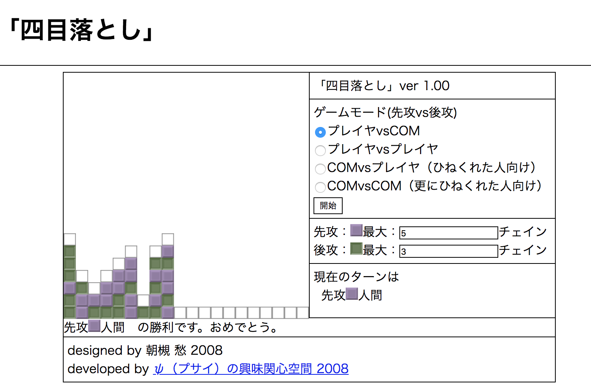

# 四目落とし(2008)

ブロックを積み上げていく[四目並べ](https://ja.wikipedia.org/wiki/%E5%9B%9B%E7%9B%AE%E4%B8%A6%E3%81%B9)です。通常の四目並べと違い、最下段、もしくはすでにブロックが置いてあるところの上にしかブロックを置くことができません。言い換えると、置ける場所は、重力に縛られます。

[YonmokuOtoshi/index.html](YonmokuOtoshi/index.html)を開くとプレイできます。